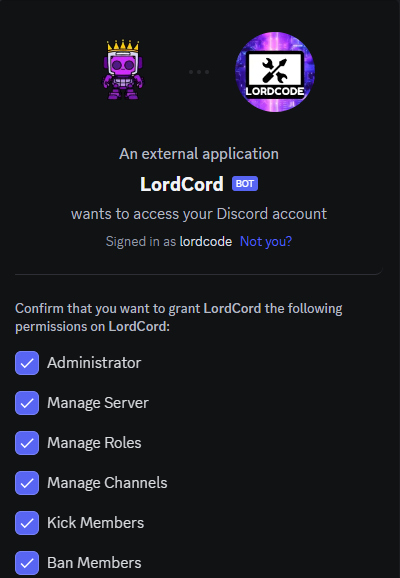

# 📕 Основная информация

## Что такое LordCord?

LordCord-это совершенно бесплатный многопользовательский бот Discord, обладающий такими функциями, как: модерация, элементы управления развлечениями, настройка сервера и т. д. У этого также есть веб-панель управления, чтобы вы могли легко

***

## Как добавить LordCord-а на севрер?

<figure><figcaption></figcaption></figure>

Выберите сервер и нажмите `Продолжить`

<figure><figcaption></figcaption></figure>

Выберете права для бота на сервере


По умолчанию выбраны все


<figure><figcaption></figcaption></figure>

И нажмите _`Авторизовать`_

***
