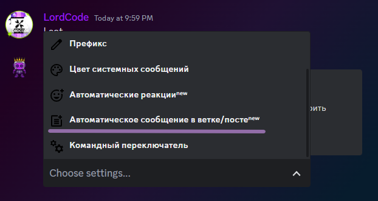

# 📕 Основная информация

## Что такое LordBot?

LordBot-это совершенно бесплатный многопользовательский бот Discord, обладающий такими функциями, как: модерация, элементы управления развлечениями, настройка сервера и т. д. У этого также есть веб-панель управления, чтобы вы могли легко

***

## Как добавить LordBot-а на севрер?

<figure><figcaption></figcaption></figure>

Выберите серевер и нажмите `Продолжить`

<figure><figcaption></figcaption></figure>

Выберете права для бота на сервере\
_**По умолчанию выбраны все**_

<figure><figcaption></figcaption></figure>

И нажмите _`Авторизовать`_

#### Бот на сервере поздравляю

***
