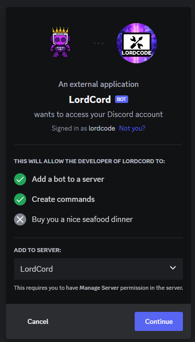
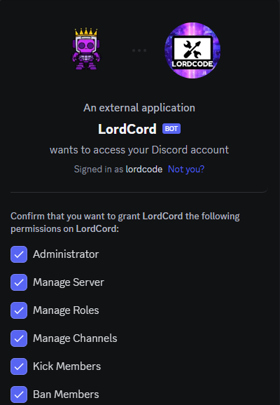
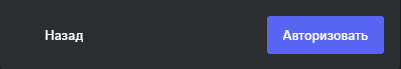

# 📕 Basic information

## What is LordCord?

LordCord is a completely free multi-user Discord bot with features such as moderation, entertainment controls, server setup, etc.

## What are our advantages?
LordCord provides user-friendly settings and an extensive set of automation features
to make your community management experience as effective as possible.

### 🖌️ Customization:
In the Customization Department, you can easily change the prefix and color of system messages to give your server a unique style. LordCord allows you to express your personality! 🎨

### 🛠️ Convenient settings:
Personalize the behavior of the bot to suit your needs. From permission management to command customization, everything is under your control.

### 🔄 Automatic updates:
LordCord is always one step ahead! The bot is automatically updated to provide you with the latest features without unnecessary hassle.
Don't waste time on routine tasks - entrust LordCord with automation and enjoy managing your community with ease!

### 🌐 Multilingual:
Welcome to the Multilingual Department of LordCord! Here you can set up the bot in any language, ensuring comfortable interaction with participants from all over the world. 🌍

### 💰 Economy:
LordCord allows you to create a unique economic system for your server. Manage resources and grow your community with us. 💹

### 🤖 Automation:
LordCord provides you with the ability to manage roles, create automatic reactions and messages when creating branches. Automate your server for maximum convenience! 🤖

## Team Settings:
The Team Settings Department is a place where you can flexibly configure the commands of the LordCord bot. Make them perfect for your community. Customization is your key to a unique experience! ⚙️

Open the door to a world of endless possibilities with LordCord, where each department is a new stage in managing your ideal server! 🌟

## How do I add LordCord to sevrer?

<figure><figcaption></figcaption></figure>

Select the server and click `Continue`

<figure><figcaption></figcaption></figure>

Select the rights for the bot on the server


By default, all are selected


<figure><figcaption></figcaption></figure>

And click `Authorize`

***

Welcome to the world of LordCord, your trusty server management bot!
