# 🟢 Auto reactions

## How do I add auto reactions?

<figure>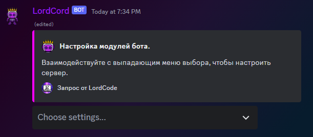<figcaption></figcaption></figure>

Select `auto reactions` in the settings

<figure>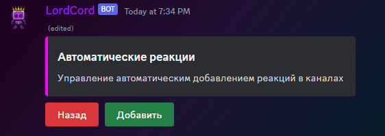<figcaption></figcaption></figure>

Click add

<figure>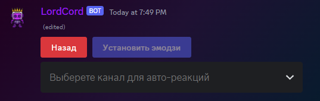<figcaption></figcaption></figure>

We select the channel you are interested in

<figure>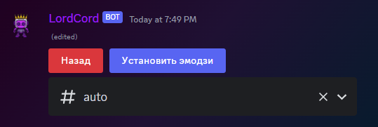<figcaption></figcaption></figure>

Click `Install Emoji`

### Which emojis are allowed and how do I install them?

<figure>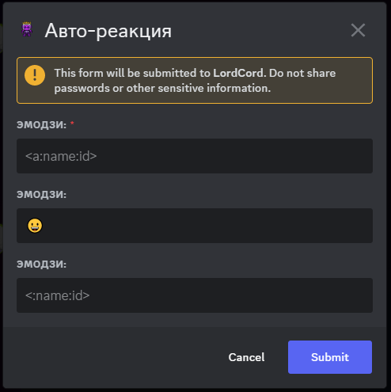<figcaption>
It is shown after clicking "Install emoji"
</figcaption></figure>

**3** types of emojis are allowed:

* Regular emojis
* Custom emojis
* Animated custom emojis

#### Regular emojis

<figure><figcaption>
Вариант 1
</figcaption></figure>

Try to highlight the desired emoji and copy it

<figure>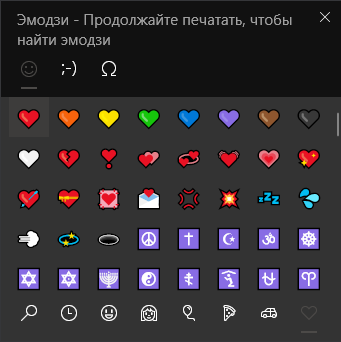<figcaption>
Вариант 2
</figcaption></figure>

If it didn't work out, try to select in **`Win + .`**


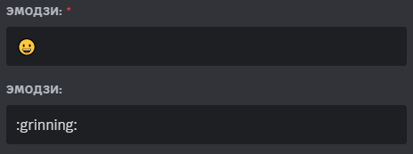

When inserting, pay attention to the emoji itself, if it is not displayed, then most likely you did something wrong!


#### Custom emojis

<figure>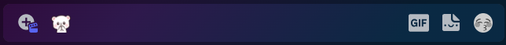<figcaption></figcaption></figure>

Select the emoji you are interested in and paste it into the text field

<figure>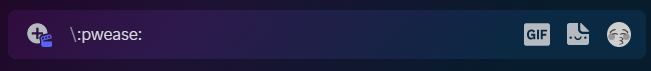<figcaption></figcaption></figure>

Next, put `\` in front of the emoji so that the text is displayed instead of the emoji

<figure>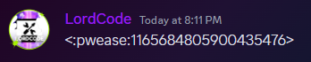<figcaption></figcaption></figure>

Send this and you should get the `<:name:id>` or `<a:name:id>` construction with an animated emoji

#### Adding emojis to the modal window

<figure>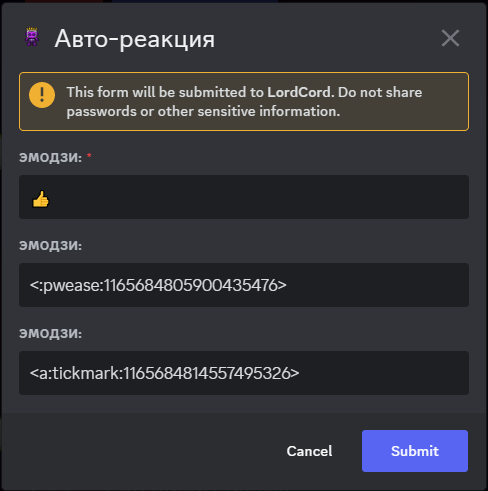<figcaption></figcaption></figure>

We insert emojis into different cells

<figure>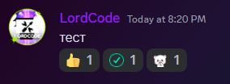<figcaption></figcaption></figure>

And we enjoy the result

## How do I change the reactions?

<figure>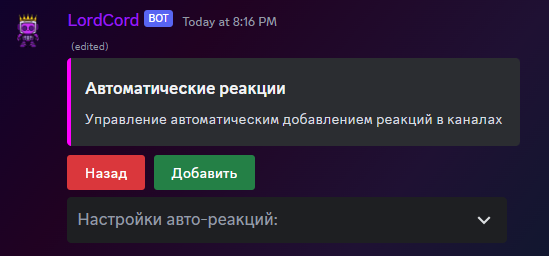<figcaption></figcaption></figure>

Go to auto reactions and select the desired channel

<figure>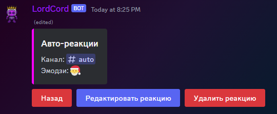<figcaption></figcaption></figure>

Click edit reactions

