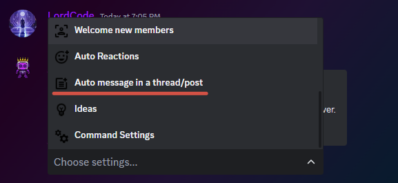
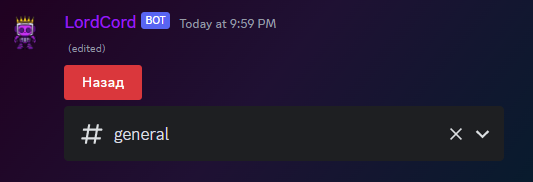
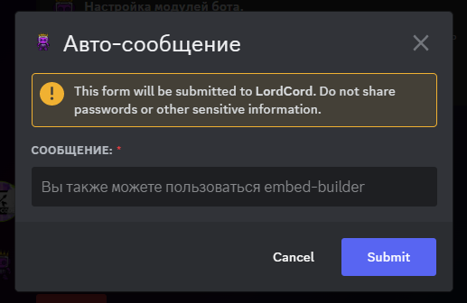
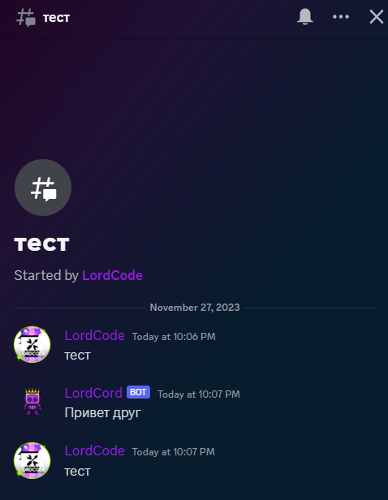
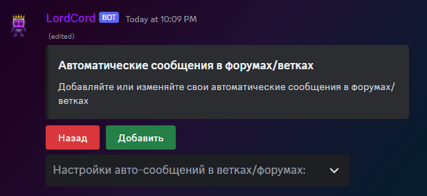
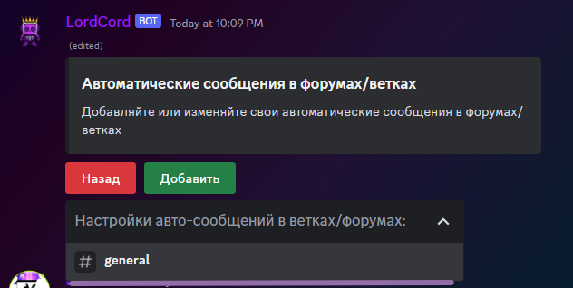
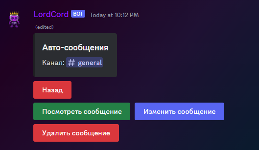

# 📮 Auto posts in branches/forums

How to create Auto posts in branches/forums

<figure><figcaption></figcaption></figure>

Open the settings and go to the `Automatic message in the branch/post`

<figure><figcaption></figcaption></figure>

When the message has loaded, click add

<figure><figcaption></figcaption></figure>

Select the channel on which we want to see auto messages

<figure><figcaption></figcaption></figure>

Next, you need to enter a message(text/json)

<figure><figcaption></figcaption></figure>

As we can see, everything worked out

***

### How do I delete or change an auto message?

<figure><figcaption></figcaption></figure>

In the settings, go to `Automatic messages in forums/branches`

<figure><figcaption></figcaption></figure>

Select the channel we are interested in

<figure><figcaption></figcaption></figure>

Here you can view the message itself, edit it and delete it
