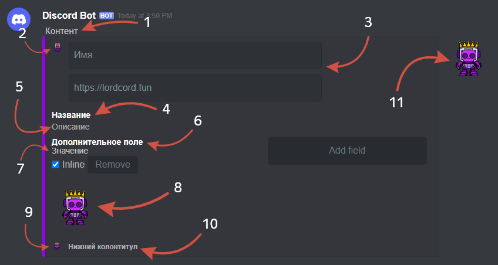
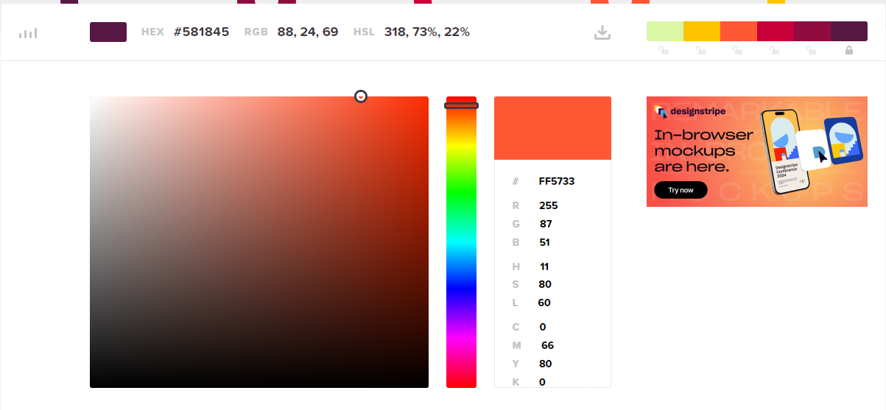

# 📝 Embed Builder


The website for creating embedded elements is [lordcord.fun/embed-builder](https://lordcord.fun/embed-builder).&#x20;

You can also use other sites with a similar focus.


## Description of the site fields

<figure><figcaption>
In the discord
</figcaption></figure>

<figure><figcaption>
In the editor
</figcaption></figure>

## Changing the color

To go to the color selection of the strip, click on it..

<figure><figcaption></figcaption></figure>

The site provides 10 standard colors!

<figure><figcaption></figcaption></figure>

If you want to use a specific color on a web page, I recommend visiting the  website [HTML Color Codes (click here)](https://htmlcolorcodes.com/), find the desired color, then copy the color code to **HEX(#)** and paste it into the **embed** program.

## The Inline parameter

<figure><figcaption></figcaption></figure>

The location of the fields depends on the Inline parameter, which can be set in a line or as a column.

<figure><figcaption></figcaption></figure>

**Inline** is enabled.

<figure><figcaption></figcaption></figure>

**Inline** выключен.


Inline is disabled by default.


## Completion of work

<figure><figcaption>
Code duplication
</figcaption></figure>

After you finish editing, click on the "**Copy**" button. This will copy the entire **JSON** code to the clipboard and you can use it.

<figure><figcaption>
Command
</figcaption></figure>

<figure><figcaption>
Result
</figcaption></figure>


Note: Various file types can be used as images, including images (PNG, JPEG, JPG, WEBM formats) and animated GIF images.&#x20;

In the form where the provision of a photo is used, you must specify a link to the photo.


