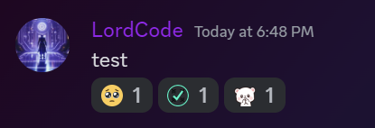

# Авто реакции

## Как добавить авто реакции?

<figure><figcaption></figcaption></figure>

Выбираем в настройках `авто реакции`

<figure><figcaption></figcaption></figure>

Жмем добавить

<figure><figcaption></figcaption></figure>

Выбираем интересующий вас канал

<figure><figcaption></figcaption></figure>

Жмем `Установить эмодзи`

### Какие эмодзи разрешены и как их установить?

<figure><figcaption>
Показывается после нажатия "Установить эмодзи"
</figcaption></figure>

Разрешены 3 типа эмодзи:

* Обычные эмодзи
* Кастомные эмодзи
* Анимированные кастомные эмодзи

#### Обычные эмодзи

<figure><figcaption>
Вариант 1
</figcaption></figure>

Постарайтесь выделить нужный эмодзи и скопировать

<figure><figcaption>
Вариант 2
</figcaption></figure>

Если не получилось попробуйте выбрать в **`Win + .`**



При вставке обратите внимание на сам эмодзи, если он не отображается то скорее всего вы сделали что то не так


#### Кастомные эмодзи

<figure><figcaption></figcaption></figure>

Выберете интересующий вас эмодзи и вставьте его в текстовое поле

<figure><figcaption></figcaption></figure>

Далее поставьте перед эмодзи `\` чтобы вместо эмодзи отобразился текст

<figure><figcaption></figcaption></figure>

Отправьте это и вы должны получить конструкцию `<:name:id>` или `<a:name:id>` при анимированном эмодзи

#### Добавляем эмодзи в модальное окно

<figure><figcaption></figcaption></figure>

Вставляем эмодзи в разные ячейки

<figure><figcaption></figcaption></figure>

И наслаждаемся результатом

## Как изменить реакции?

<figure><figcaption></figcaption></figure>

Заходим в авто реакции и выбираем нужный канал

<figure><figcaption></figcaption></figure>

Жмем редактировать реакции

**Далее все как и в добавлении реакции!**
