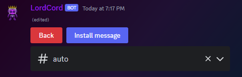
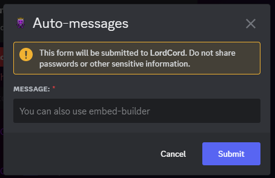
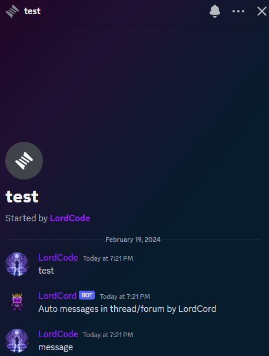
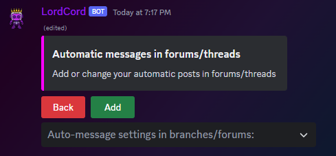
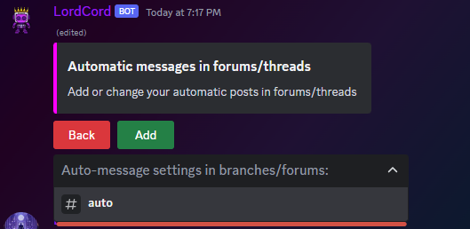
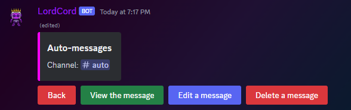

# Авто сообщения в ветках/форумах

## Как создать Авто сообщения в ветках/форумах

<figure><figcaption></figcaption></figure>

Открываем настройки и заходим в `Автоматическое сообщение в ветке/посте`

<figure><figcaption></figcaption></figure>

Когда сообщение прогрузилось жмем добавить

<figure><figcaption></figcaption></figure>

Выбираем канал на которым хотим видеть авто сообщения

<figure><figcaption></figcaption></figure>

Далее надо ввести сообщение(текст/json)

<figure><figcaption></figcaption></figure>

Как мы видим все получилось

***

### Как удалить или изменить авто сообщение?

<figure><figcaption></figcaption></figure>

В настройках переходим в `Автоматические сообщения в форумах/ветках`

<figure><figcaption></figcaption></figure>

Выбираем интересующей нас канал

<figure><figcaption></figcaption></figure>

Здесь можно посмотреть само сообщение, изменить его и удалить

***
