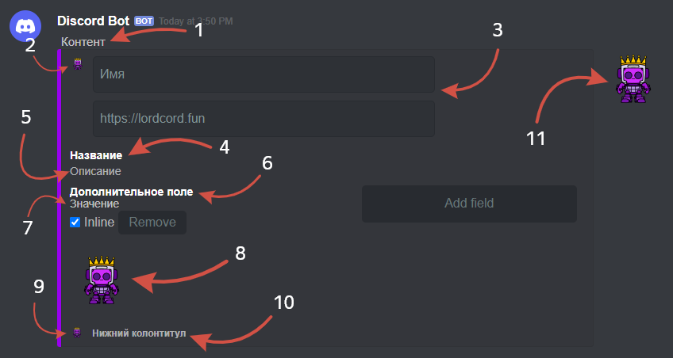
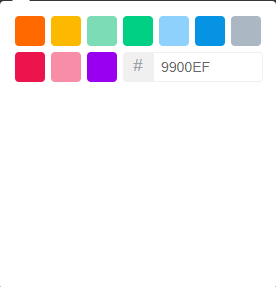
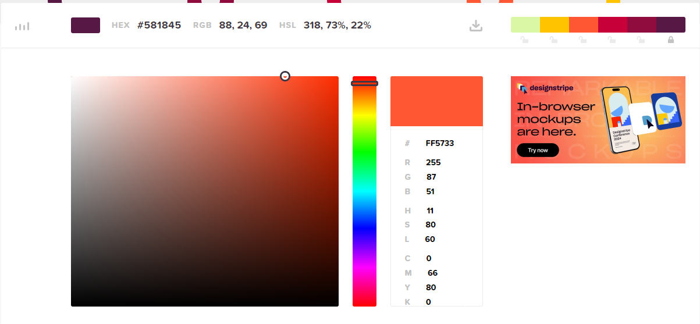
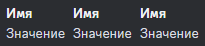
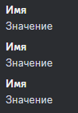
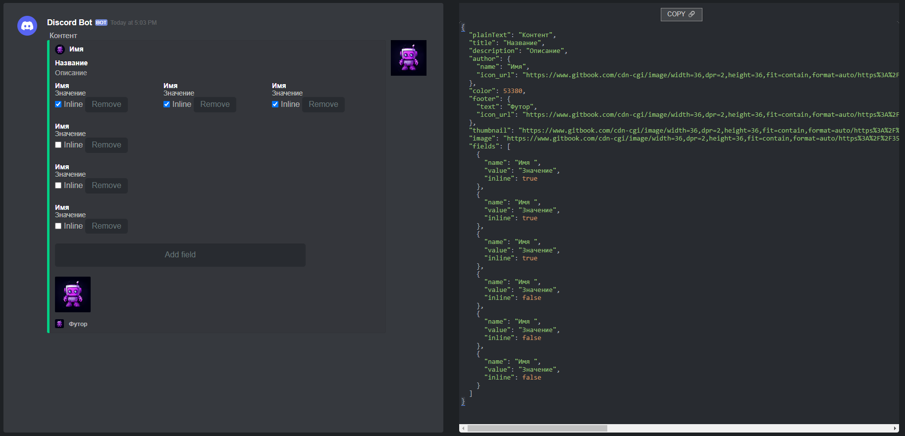
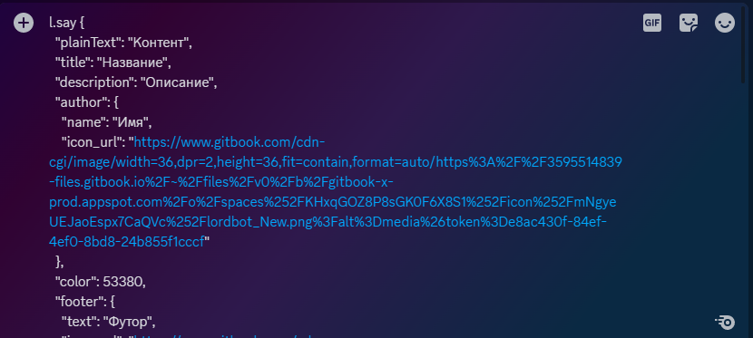

# Embed Builder


Сайт для создания встраиваемых элементов - [lordcord.fun/embed-builder](https://lordcord.fun/embed-builder).

Можно также использовать другие сайты схожей направленности.


## Описание полей сайта

<figure><figcaption>
В дискорде
</figcaption></figure>

<figure><figcaption>
В редакторе
</figcaption></figure>

## Изменение цвета

Для того чтобы перейти к выбору цвета полоски - нажмите на неё.

<figure><figcaption></figcaption></figure>

Сайт предоставляет 10 стандартных цветов!

<figure><figcaption></figcaption></figure>

Если вы хотите использовать определенный цвет на веб-странице, рекомендую посетить сайт [HTML Color Codes (кликните здесь)](https://htmlcolorcodes.com/), найти желаемый цвет, затем скопировать цветовой код в HEX(#) и вставить его в программу для создания embed.

### Параметр Inline

<figure><figcaption></figcaption></figure>

Расположение полей зависит от параметра Inline, который может быть установлен в линию или в виде столбца.

<figure><figcaption></figcaption></figure>

Inline включён.

<figure><figcaption></figcaption></figure>

Inline выключен.


По умолчанию inline выключен.


## Завершение работы

<figure><figcaption>
Дублирование кода
</figcaption></figure>

После того, как вы закончите редактировать, нажмите на кнопку “Copy”. Это скопирует весь JSON код в буфер обмена, и вы сможете использовать его.

<figure><figcaption>
Команда
</figcaption></figure>

<figure><figcaption>
Результат
</figcaption></figure>


Примечание: в качестве изображения могут использоваться различные типы файлов, включая картинки (форматы PNG, JPEG, JPG, WEBМ) и анимированные изображения в формате GIF.\
В форме, где используется предоставление фотографии, необходимо указать ссылку на фотографию.

