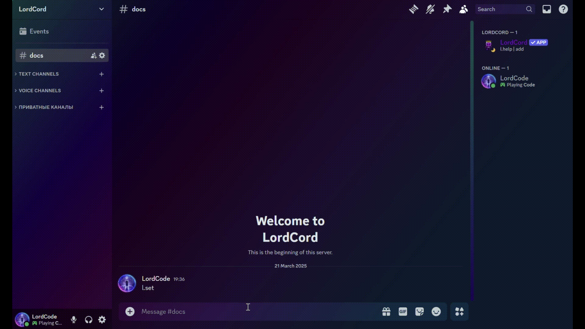
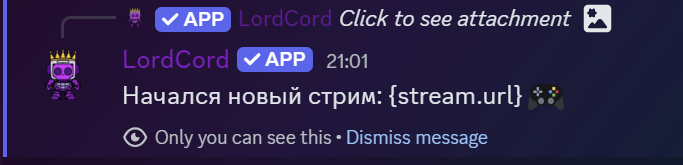

# Логирование сервера

## Как создать журнал изменений?

<figure><figcaption></figcaption></figure>

Выберите `Журнал изменений`, затем во второй панели выберите канал и необходимые логи!

## Как изменить журнал изменений?

<figure><figcaption></figcaption></figure>

Выберите канал в первой панели, который вы хотите изменить, и укажите новые логи! \
Не забудьте нажать на `Редактировать`!

## Как удалить журнал изменить?

<figure><figcaption></figcaption></figure>

Выберите канал в первой панели, который вы хотите изменить, и нажмите `Удалить`!&#x20;

## Какие есть Логи?

### Удаление сообщения

<figure><figcaption></figcaption></figure>

Лог содержит информацию о всех удаленных сообщениях в системе. \
Он помогает отслеживать, кто и когда удалил сообщение, и обеспечивает прозрачность в отношении удаленных данных.

### Редактирование сообщения

<figure><figcaption></figcaption></figure>

Лог содержит информацию о всех сообщениях, которые были изменены после отправки. Он предоставляет возможность просмотра истории изменений сообщений, что полезно для контроля целостности коммуникации.

### Нарушение правил и наказание

<figure><figcaption>
Таймаут
</figcaption></figure>

<figure><figcaption>
Таймаут вышел
</figcaption></figure>

Лог включает информацию о примененных наказаниях в ответ на нарушения правил. Он помогает поддерживать порядок и дисциплину в системе, обеспечивая справедливость и последовательность в применении мер дисциплинарного воздействия.

### Транзакция или изменения в экономике

<figure><figcaption></figcaption></figure>

Лог отражает все транзакции и изменения в экономике системы. Он предоставляет информацию о всех финансовых операциях, произошедших в системе, и помогает отслеживать денежные потоки и изменения в экономической ситуации.

### Предложение или идея

<figure><figcaption></figcaption></figure>

Лог содержит информацию о всех предложенных идеях и предложениях, которые были рассмотрены в системе. Он помогает отслеживать процесс развития идей и принятия решений на основе предложений от участников.

### Голосовое состояние

<figure><figcaption></figcaption></figure>

Журнал содержит информацию о входе, выходе и передвижении пользователя в войсках.

### Тикеты

<figure><figcaption></figcaption></figure>

Создание, закрытие, удаление, повторное открытие - все это содержится в журнале регистрации заявок.

### Роли

<figure><figcaption></figcaption></figure>

Информация о выдаче и отзыве ролей содержится в журнале.

***


В дальнейшем некоторые типы могут быть изменены, а также могут быть введены новые.

