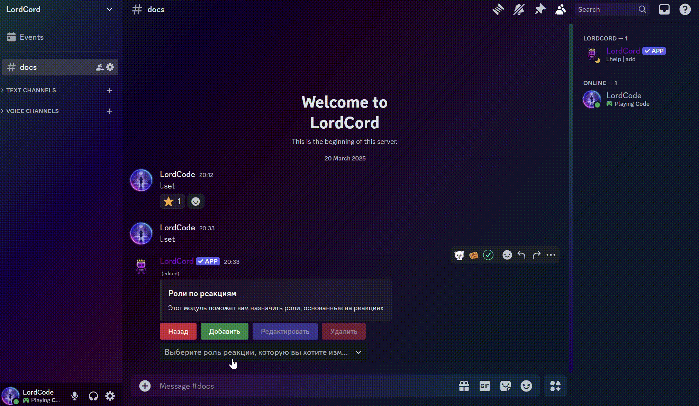

# Роли за реакции

## Как создать роли за реакции?

<figure><figcaption></figcaption></figure>

Выполните команду `l.set` далее выберите категорию **Роли реагирования**, а далее нажмите кнопку **Создать**.

Выберите **канал** и **сообщение** в нём, нажмите далее.

После того [как создадите эмодзи](roli-za-reakcii.md#kak-dobavit-izmenit-emodzi) нажмите **Создать**!

## Как редактировать / удалить панель?

<figure><figcaption></figcaption></figure>

Для редактирования выберите панель и нажмите кнопку "Редактировать". \
Чтобы удалить, выберите панель и нажмите "Удалить".

## Как добавить / изменить эмодзи?

<figure><figcaption></figcaption></figure>

Выберите роль, а далее нажмите **Редактировать**, отправьте сообщение или воспользуйтесь модульным окном для выбора эмодзи!


Чтобы обновить или создать группу эмодзи и применить реагирующие эмодзи, нажмите кнопку "**Создать**".



**Использование эмодзи** разрешается только на серверах, где присутствует бот, даже если вы не являетесь администратором!


