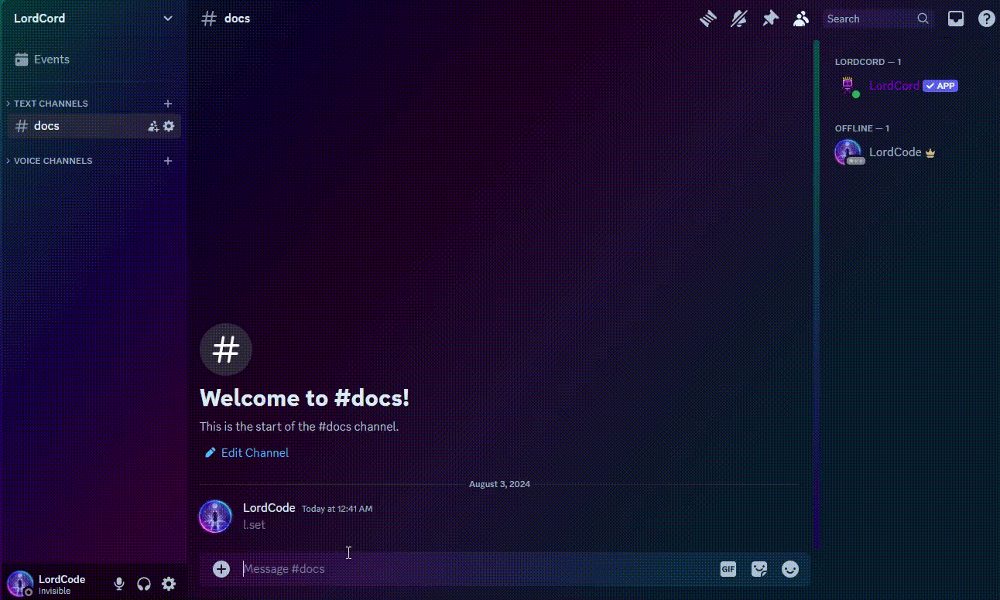
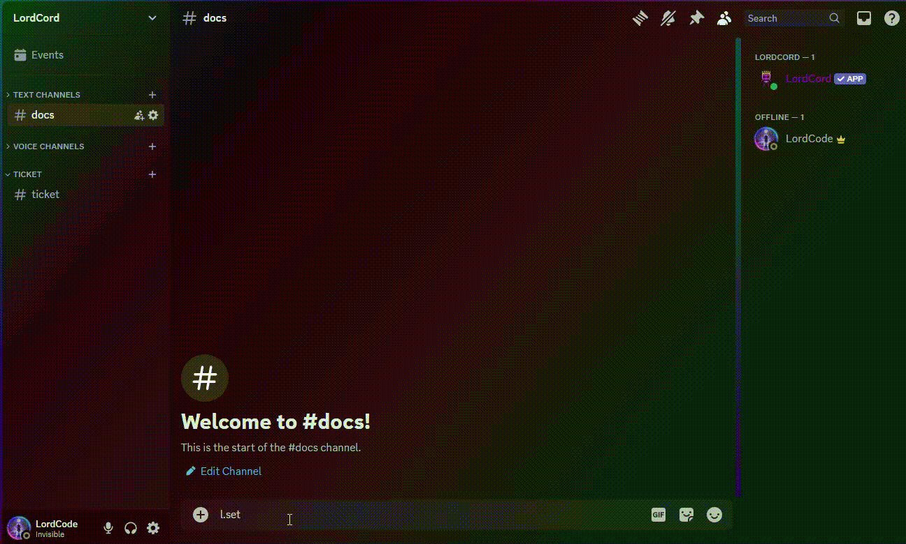
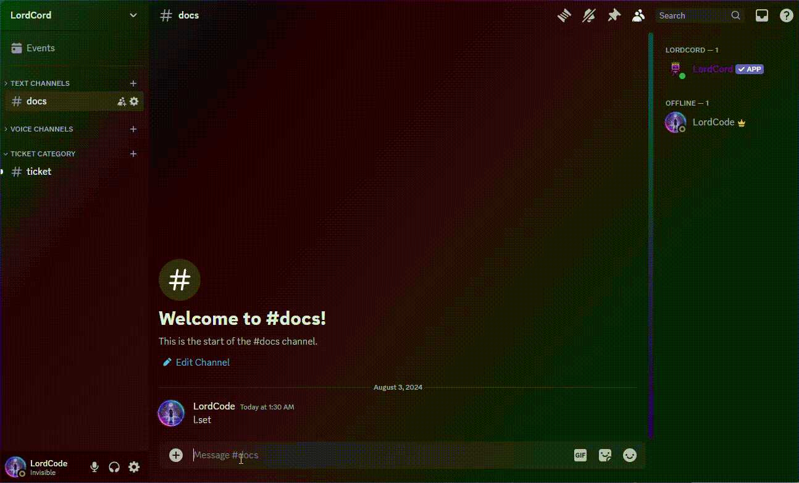
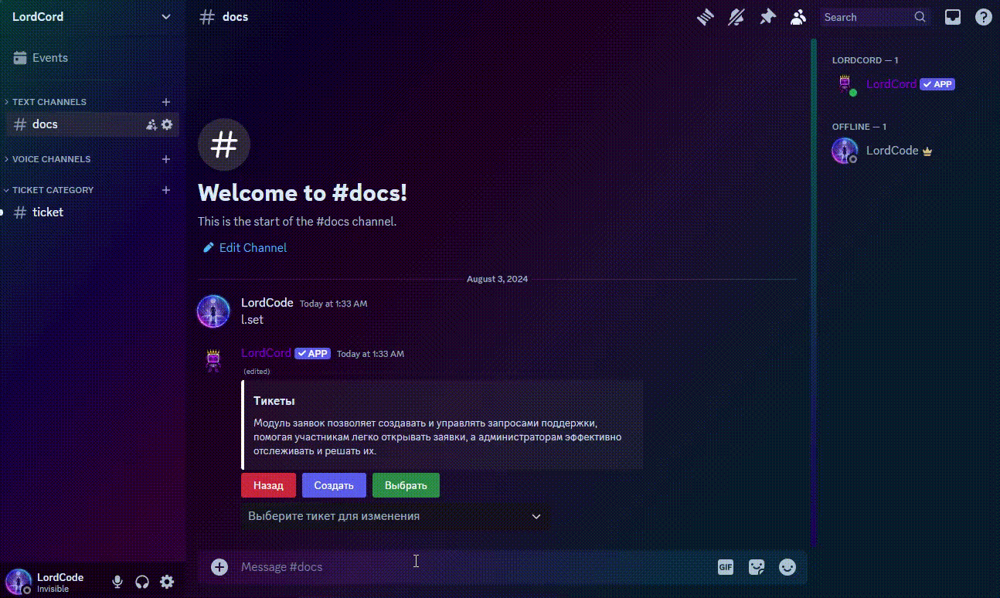
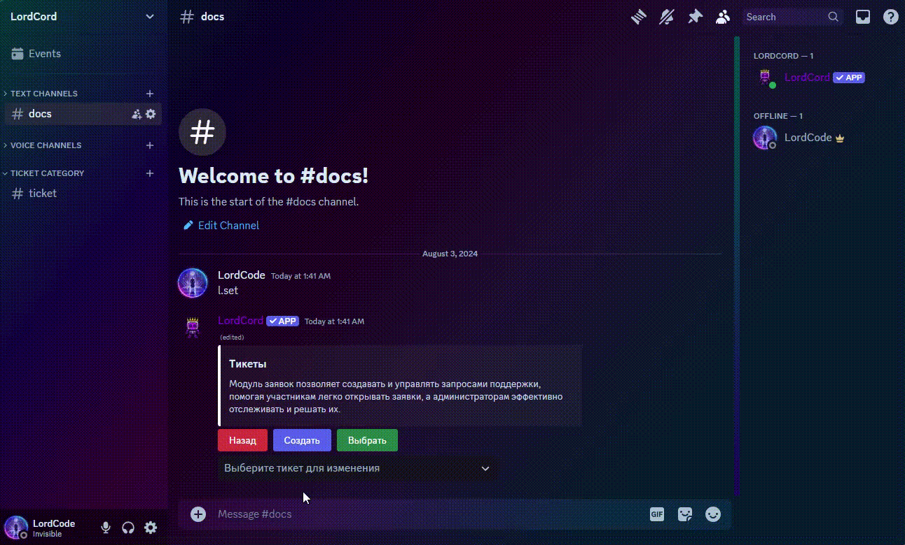

# 🎟️ Тикеты

## Как создать панель тикетов?

<figure><figcaption></figcaption></figure>

Выберите категорию **Тикеты**, а далее нажмите кнопку **Создать**.

### Как выбрать каналы?

<figure><figcaption></figcaption></figure>

Выберите категорию **Тикеты**, а далее нажмите кнопку **Выбрать**, после выберите панель тикета и по желанию его категорию, если она не будет указано, то по умолчанию будет категория панели.

## Как изменить каналы / категории?

<figure><figcaption></figcaption></figure>

Выберите категорию **Тикеты**, а далее выберие нужную панель тикетов, после нажмите кнопку **Каналы и категории заявок**, и наконец выберите новый канал.

## Как удалить тикеты?

<figure><figcaption></figcaption></figure>

Выберите категорию **Тикеты**, а далее выберие нужную панель тикетов, после нажмите кнопку **Удалить с каналами**, если вы хотите чтоб каналы тоже были удалены, если же вы хотите чтобы каналы остались, то нажмите просто **Удалить**.

## Как изменить настройки тикетов?

<figure><figcaption></figcaption></figure>

Выберите категорию **Тикеты**, а далее выберие нужную панель тикетов, после этого выберите нужный атрибут настроек.

### Как выключить тикет?

<figure><figcaption></figcaption></figure>

Нажмите на кнопку **Выключить**, чтобы обратно включить тикет нажмите на ту же кнопку которая станет **Включить**

### Как запретить / разрешить пользователям закрывать тикет?

<figure><figcaption></figcaption></figure>

Таким образом, вы можете разрешить / запретить пользователям закрывать заявку

### Как изменить тип тикета?

<figure><figcaption></figcaption></figure>

Выбирайте тип тикета в зависимости от того, какой из них вам удобен

#### Каналы

<figure><figcaption></figcaption></figure>

Создается канал с правами для модераторов и пользователя.

#### Ветки

<figure><figcaption></figcaption></figure>

Создается ветка в канале панели.


При самостоятельном выборе панели тикета, учитывайте права пользователей, так как пользователи могут не смочь писать в тикет при отключённом параметре **Отправлять сообщения в ветках**.


### Как поменять стандартные сообщения?&#x20;

<figure><figcaption></figcaption></figure>

Откройте параметры сообщений, а далее выбирайте нужное вам сообщение чтобы изменить.

#### Панель

<figure><figcaption>
Сообщение в панели
</figcaption></figure>

#### Категория

<figure><figcaption>
Сообщение в выборе категории
</figcaption></figure>

#### Открыть

<figure><figcaption>
Сообщение при открытии тикета
</figcaption></figure>


Вы можете использовать [embed-builder](embed-builder/ "mention")и [variables.md](embed-builder/variables.md "mention")


### Как изменить стандартное название тикета?

<figure><figcaption></figcaption></figure>

Нажмите **Название заявки** и у вас появится окно для редактирования имени.


Вы можете использовать [variables.md](embed-builder/variables.md "mention")


### Как добавить формы?

<figure><figcaption></figcaption></figure>

Выберите **Формы Заявки** и далее нажмите добавить.

#### Вставка с ответами

<figure><figcaption>
Включено
</figcaption></figure>

<figure><figcaption>
Выключено
</figcaption></figure>


Чтобы использовать значение из форм используйте переменную `ticket.forms.n`, где **n** это номер пункта формы, начиная с 0!


#### Обязательно / по желанию

<figure><figcaption></figcaption></figure>

#### Короткий / параграф

<figure><figcaption>
Короткий тип и параграф, и чем они отличаются
</figcaption></figure>

<figure><figcaption>
Короткий
</figcaption></figure>

<figure><figcaption>
Параграф / длинный 
</figcaption></figure>

#### Пометка

<figure><figcaption>
Текст, который исчезает, когда вы начинаете редактировать.
</figcaption></figure>

### Как добавить FAQ / ЧаВо?

**FAQ** - Frequently Asked Questions\
**ЧаВо** - Часто задаваемые вопросы\
_**FAQ = ЧаВо**_

<figure><figcaption></figcaption></figure>

Выберите **ЧаВо Заявки**, далее нажмите добавить.

#### Как изменить элемент FAQ / ЧаВо?

<figure><figcaption></figcaption></figure>

Выберите **ЧаВо Заявки**, далее выберите нужный элемент, и нажмите **Редактировать**.

#### Как удалить элемент FAQ / ЧаВо?

<figure><figcaption></figcaption></figure>

Выберите **ЧаВо Заявки**, далее выберите нужный элемент, и нажмите **Удалить**.

#### Как изменить тип FAQ / ЧаВо?

<figure><figcaption></figcaption></figure>

Выберите **ЧаВо Заявки** и выберите нужный **тип ЧаВо**.

<figure><figcaption>
Тип выпадающее меню и кнопка
</figcaption></figure>

<figure><figcaption>
Кнопка
</figcaption></figure>

<figure><figcaption>
Выпадающее меню
</figcaption></figure>

### Как добавить категории?

<figure><figcaption></figcaption></figure>

Выберите **Категории**, далее нажмите добавить.

### Как изменить категорию?

<figure><figcaption></figcaption></figure>

Выберите **Категории**, далее выберите нужную категорию, и нажмите **Редактировать**.
